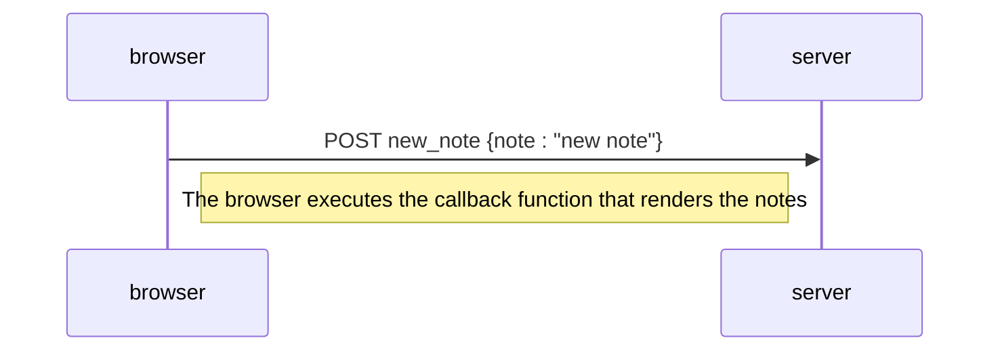

```mermaid

sequenceDiagram
    participant browser
    participant server

    browser->>server: POST new_note {note : "new note"}
    activate server
 
    Note right of browser: The browser executes the callback function that renders the notes
    
```
